========================
Connectome Mapper Stages
========================

General description
-------------------

Project settings / Main Tab
---------------------------

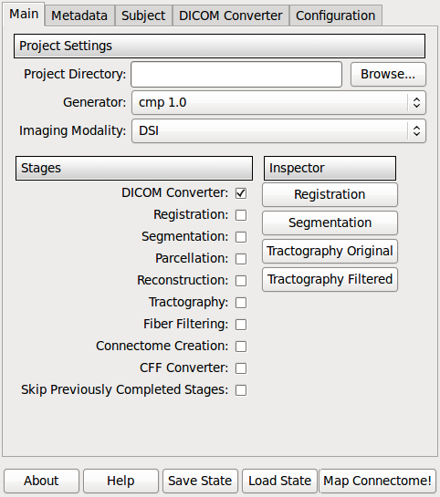

Project directory
    Select the root folder of your project which contains the subfolders for all the subjects of this project.
Generator
    Which version of the mapper to use. Defaults to cmp 1.0
Imaging Modality
    What type of data to process. Currently supports DSI and DTI data.

Stages
    Select the stages you want to run. A good practice is to incrementally select the stages to be processed. So you keep good control of what is going on.
Inspector
    Lets you inspect the result of different processing stages, using external packages such as FSL, Freesurfer or Diffusion Toolkit.

Buttons

* About: Information about the pipeline, copyright, contributors etc.
* Help: Show help information for each processing stage
* Save state: Save the entered information, parameters etc in order not to enter them again.
* Load state: You can load a saved state.
* Map Connectome! : Start the processing of the selected stages. Information and error messages are written to the console.

Project-related information / Metadata Tab
------------------------------------------

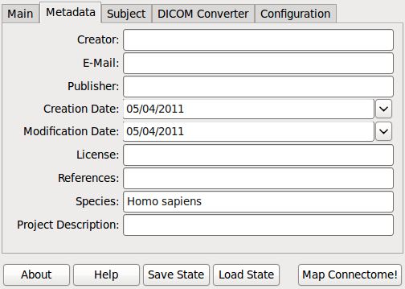

Enter relevant project-wide metadata. Keep in mind that good metadata eases the reuse of the data a lot later on. The
metadata fields are derived from the `Dublin Core Metadata Standards <http://dublincore.org/documents/dcmi-terms/>`_

* Creator: The dataset creator.
* Publisher: Institution that published the dataset.
* Created: Dataset creation date
* Modified: Dataset modification date
* Rights: Like copyrights
* License: The license of the data
* References: E.g. Reference to a journal paper which used this dataset
* Relation: Related resources, such as an URL
* Species: Binomal species name
* Email: Email address of the contact person of the dataset.
* Project description: A short general project description.

Subject/Timepoint related information
-------------------------------------

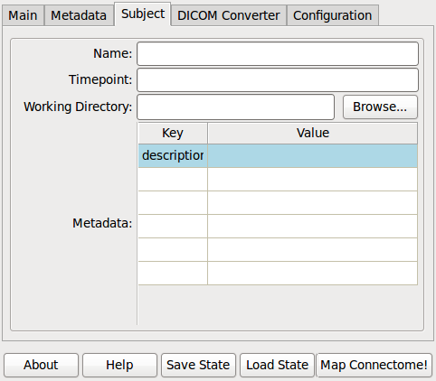

Name
    Specify a name/ID/own code for the subject. The name is reused as folder name in the project structure.

Timepoint
    Enter the timepoint name. Should correspond to the folder name.

Working Directory
    Automatically generated using the project directory and name and timepoint informatino. You can change it by selecting
    the folder that contains the RAWDATA folder. Usually, this should be project/subject/timepoint

Metadata
    Add key-value metadata fields  for this subject and timepoint. This metadata can be reused for processing later.
    Examples are age, handedness etc.

DICOM Converter
---------------

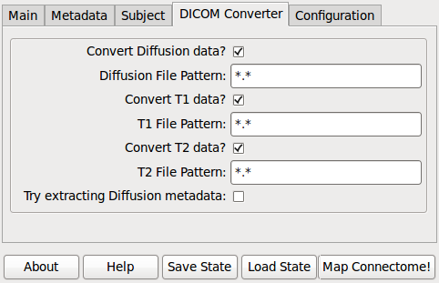

Converts the raw DICOM data files in the RAWDATA subfolders into the Nifti format. It is possible to convert independently
the structural data (T1 and T2) and the diffusion one (DSI,DTI). Performs required flipping if needed.
If the DICOM files have no file name ending, just enter * as the file pattern.

If you have not acquired any structural T2 image, you can deselect the corresponding checkbox. However, diffusion data and T1 data are required.

If you select the extraction of diffusion metadata, bvalues and bvector textfiles are tried to be extracted using
the Nibabel DICOM reader (supporting Siemens DICOM so far) extracted from the DICOM files and stored in
the NIFTI/diffusion_metadata folder for your subject/timepoint.

For the conversion, packages such as Diffusion Toolkit and Nibabel are used.

Registration
------------

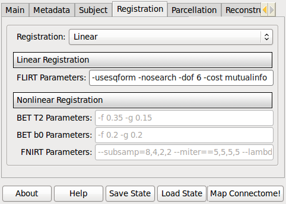

This stage allows to register the structural T1 image (where the parcellation of the cortical surface is extracted) onto the diffusion space.

Choose *Linear* if you only acquired the structural T1 image and you miss the additional T2. In this way, the stage will
try to align the T1 directly onto the b0 image.

If additional T2 images have been acquired, *Nonlinear* registration can be performed. A two steps procedure is performed:

1) First, a linear registration if performed between the T1 and the T2; these images don't share the same contrast but
   there are no distortions between them, so a linear registration will suffice.
2) Then, a nonlinear registration will try to align the T2 image and the b0 one, and then the two transformations are concatenated.
   To preserve edges, a intermediate skull-stripping step is performed on both images by using `BET <http://www.fmrib.ox.ac.uk/fsl/bet2/index.html>`_.

We use the nonlinear registration approach in order to mitigate the nonlinear distortions which are present in diffusion images.
Future versions of the pipeline will account for other methods to achieve this (e.g. fieldmaps).

Linear Registration
~~~~~~~~~~~~~~~~~~~
The FSL linear registration tool `FLIRT <http://www.fmrib.ox.ac.uk/fsl/flirt/index.html>`_ is used to perform this step.
Default parameters (which can be modified) generally give good results in most cases.

Nonlinear Registration
~~~~~~~~~~~~~~~~~~~~~~
The FSL nonlinear registration tool `FNIRT <http://www.fmrib.ox.ac.uk/fsl/fnirt/index.html>`_ is used to perform this step.
Default parameters (which can be modified) generally give good results in most cases.

Parcellation
------------

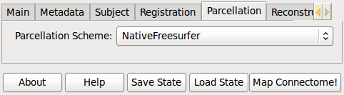

We provide two parcellation schemes.

NativeFreesurfer
    The native Freesurfer parcellation using the `Desikan-Killiany Atlas <http://surfer.nmr.mgh.harvard.edu/fswiki/CorticalParcellation>`_
    extended to include subcortical regions.

.. warning::

    Lausanne2011
        The multi-resolution parcellation that was used in Hagmann et al. 2008. It is currently updated
        to incorporate the changes of the new Freesurfer 5.0 version.

Apply registration
------------------

The registration transformations are applied to the white matter mask and the parcellation to map them into the diffusion space.

Reconstruction
--------------

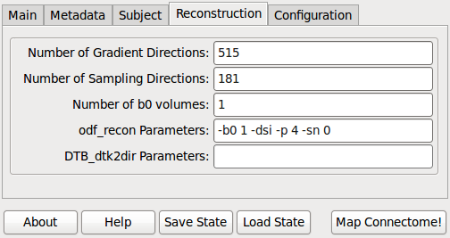

Use `DiffusionToolkit <http://www.trackvis.org/dtk/>`_ for extracting the orientation distribution function (ODF), the default parameters are the same as DTKs.

Please refer to `odf_recon <http://www.trackvis.org/dtk/?subsect=script#odf_recon>`_ documentation for the meaning of each parameter.

Tractography
------------

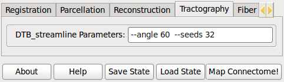

This module runs a classical streamline fiber-tracking algorithm (Weeden et al. (2003), Diffusion spectrum magnetic resonance imaging (DSI))
tractography adapted to deal with possible multiple directions inside each voxel.

The following parameters are automatically set by the mapper:
Tracking is performed inside the white matter mask computed by FreeSurfer (--wm parameter) and is started in each non-zero
voxel of the seed mask (--seed parameter); if no such a mask is give, then all voxels will be considered.
Trajectories are iteratively propagated following coherent diffusion directions inside each voxel (--dir parameter) by using a fixed step size
(--stepSize parameter) and the Euler integration method, and are stopped when a stopping criteria is met.

The following parameters are recommended to be explored:
Stopping criteria are: trajectories are outside the white matter mask or no compatible direction are found below a specific crossing angle, --angle parameter).
Only diffusion directions with a volume fraction greater than a threshold are considered (--vf parameter).
For some imaging modalities, this parameter has no sense (e.g. DTI) and it is ignored.
Multiple seed points can be created inside each voxel (--seeds parameter); this way, multiple trajectories
will be started for every direction inside each voxel.

Fiber Filtering
---------------

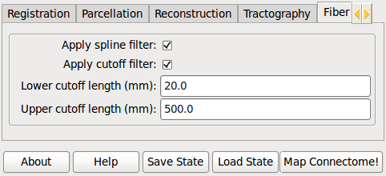

Apply spline filter
    Fibers are spline-filtered using diffusion toolkit. Please refer to `spline_filter <http://www.trackvis.org/dtk/?subsect=script#spline_filter>`_ documentation.

Apply cutoff filter: Fibers can be filtered depending on their length:

* Lower cutoff: Fibers smaller than this cutoff length are filtered.
* Upper cutoff: Fibers longer than this cutoff length are filtered.

Connectome File Format Converter
--------------------------------

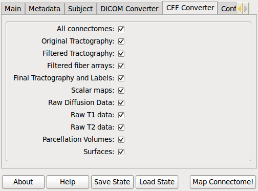

Raw and processed data are stored in the connectome file for further analysis in the Connectome Viewer or elsewhere.

All connectomes
    All the connectivity information for the different resolutions.

Tractography
    Store the tractography results.

Parcellation Volumes
    Store the parcellated volumes in the same space as the T1 data.

Raw T1 data
    Store the raw T1 data in Nifti format.

Raw T2 data
    Store the raw T2 data in Nifti format if available.

Individual surfaces
    Store the surfaces extracted by Freesurfer in Gifti format.

Configuration
-------------

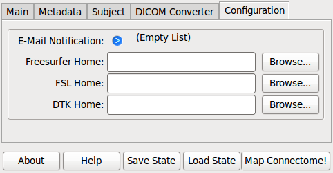

E-Mail notification
    If you have installed an SMTP server, you can enter a list of email addresses to which an email is sent after the completion of a stage.

Environment variables
    They are recognized by your current .bashrc settings. These fields should not be empty, otherwise you have to add the
    missing environment variables in your environment. Changing the paths only in this option is not sufficient.